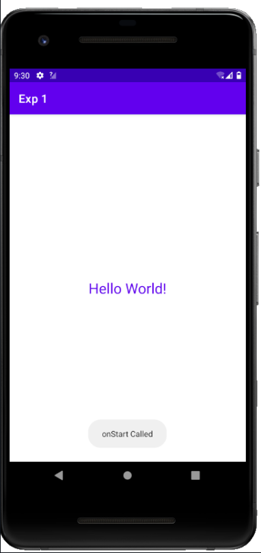
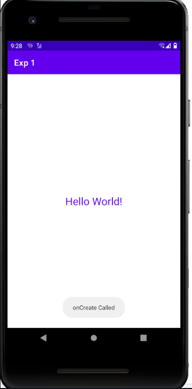
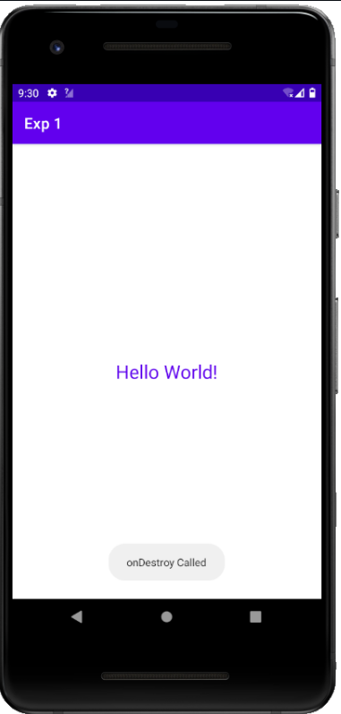

# Ex.No:1 To create a HelloWorld Activity using all lifecycles methods to display messages

Date :16.03.23

### AIM:
To create a HelloWorld Activity using all lifecycles methods to display messages using Android Studio.

### EQUIPMENTS REQUIRED:
Latest Version Android Studio.

### ALGORITHM:
Step 1: Open Android Stdio and then click on File -> New -> New project.

Step 2: Then type the Application name as HelloWorld and click Next.

Step 3: Then select the Minimum SDK as shown below and click Next.

Step 4: Then select the Empty Activity and click Next. Finally click Finish.

Step 5: Design layout in activity_main.xml.

Step 6: Display message give in MainActivity file.

Step 7: Save and run the application.

### PROGRAM:
Program to print the text Hello World

Developed by:Sreevarsha.D

Registeration Number :212221040159

MainActivity.java

```
package com.example.helloworld;
import androidx.appcompat.app.AppCompatActivity;
import android.os.Bundle;
import android.util.Log;
import android.widget.Toast;

public class MainActivity extends AppCompatActivity {

    private static final String TAG = "HelloWorldActivity";

    @Override
    protected void onCreate(Bundle savedInstanceState) {
        super.onCreate(savedInstanceState);
        setContentView(R.layout.activity_main);
        Log.d(TAG, "onCreate: ");
        Toast.makeText(this, "onCreate", Toast.LENGTH_SHORT).show();
    }

    @Override
    protected void onStart() {
        super.onStart();
        Log.d(TAG, "onStart: ");
        Toast.makeText(this, "onStart", Toast.LENGTH_SHORT).show();
    }

    @Override
    protected void onResume() {
        super.onResume();
        Log.d(TAG, "onResume: ");
        Toast.makeText(this, "onResume", Toast.LENGTH_SHORT).show();
    }

    @Override
    protected void onPause() {
        super.onPause();
        Log.d(TAG, "onPause: ");
        Toast.makeText(this, "onPause", Toast.LENGTH_SHORT).show();
    }

    @Override
    protected void onStop() {
        super.onStop();
        Log.d(TAG, "onStop: ");
        Toast.makeText(this, "onStop", Toast.LENGTH_SHORT).show();
    }

    @Override
    protected void onDestroy() {
        super.onDestroy();
        Log.d(TAG, "onDestroy: ");
        Toast.makeText(this, "onDestroy", Toast.LENGTH_SHORT).show();
    }

    @Override
    protected void onRestart() {
        super.onRestart();
        Log.d(TAG, "onRestart: ");
        Toast.makeText(this, "onRestart", Toast.LENGTH_SHORT).show();
    }
}
```
activitymain.xml
```
<?xml version="1.0" encoding="utf-8"?>
<androidx.constraintlayout.widget.ConstraintLayout xmlns:android="http://schemas.android.com/apk/res/android"
    xmlns:app="http://schemas.android.com/apk/res-auto"
    xmlns:tools="http://schemas.android.com/tools"
    android:layout_width="match_parent"
    android:layout_height="match_parent"
    tools:context=".MainActivity">

    <TextView
        android:layout_width="238dp"
        android:layout_height="105dp"
        android:text="Hello World!"
        android:textSize="100px"
        android:textStyle="italic"
        app:layout_constraintBottom_toBottomOf="parent"
        app:layout_constraintEnd_toEndOf="parent"
        app:layout_constraintHorizontal_bias="0.591"
        app:layout_constraintStart_toStartOf="parent"
        app:layout_constraintTop_toTopOf="parent"
        app:layout_constraintVertical_bias="0.499" />

</androidx.constraintlayout.widget.ConstraintLayout>`
```

### OUTPUT:








### RESULT:
Thus a Simple Android Application create a HelloWorld Activity using all lifecycles methods to display messages using Android Studio is developed and executed successfully.
